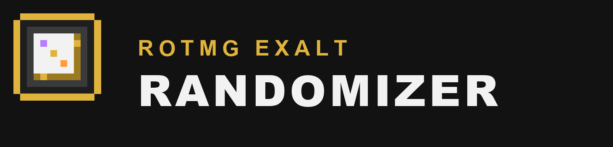

  

A randomizer for Realm of the Mad God Exalt. Roll a random class with gear it can equip, spin a wheel for your dungeon, pick challenge rules, track your run and race friends on a bingo card. Made to be fun on stream too.

## Tabs

| Tab | What it does |
| --- | --- |
| Randomizer | A random class plus a weapon, ability, armor and ring that class can use. |
| Wheel | Spin for a dungeon, a dungeon difficulty, a class, a challenge, a curse or your own list. |
| Challenges | Turn on challenge modes like PPE, UPE or TPE, and add your own house rules. |
| Run | Run timer, counters for deaths, dungeons and white bags, active curses and a log. |
| Bingo | A bingo card of RotMG goals. Share the link and friends get the same card. |
| Stream | OBS overlay, Twitch chat commands and votes, and hotkeys. |

## Randomizer

1. Press **Randomize**. You get a class and four items.
2. Press a slot's **reroll** button to reroll only that slot.
3. Press a slot's **lock** button to keep it when you randomize again.
4. Use **Copy link**, **Copy as text** or **Copy image** to share your build.

Extras, all in the settings for the tab:

- **Reveal**: every roll is hidden behind "?" cards. Click one to reveal it. Items drop in a loot bag that matches the in-game bag color, and better bags shake harder before they open.
- **Reroll limit**: a set number of rerolls per run.
- **No repeats**: classes or items you already rolled stay out until the list is used up.
- **Daily roll**: everyone gets the same build today.
- **Odds**: shows how rare your exact build was.

## Wheel

Pick a list and press **Spin**. Short lists use a wheel. Long lists, like dungeons, use a case opening reel. You can change this in the settings.

- Turn on **Remove rolled options** and each result leaves the wheel until you put it back.
- Spin **Dungeon difficulty** first, then spin a dungeon from that difficulty.
- Win a class to roll gear for it. Win a challenge to turn it on.
- Edit the Curses list or make your own lists under **Edit options**.

## Streaming

- **Pop-out window**: opens a clean window that copies what you do on the main page. Capture it in OBS with Window Capture.
- **OBS link**: add it as a Browser Source. The background can be transparent, green or magenta. OBS runs its own browser, so this is a separate copy that you control with Twitch commands or OBS Interact. To show exactly what you do on the main page, use the pop-out window.
- **Twitch chat**: type your channel and press Connect. It only reads chat, so no login is needed. Chat can use `!roll`, `!reveal`, `!spin`, `!vote` and `!death`, and vote 1 to keep or 2 to reroll. You choose who can use commands.
- **Hotkeys**: every main action has a key, and you can change them. They work as normal key presses from a Stream Deck.

## Look and sound

Settings > General has the theme (Dungeon, Nexus or Void), font (Pixel, Pixel titles only, or Plain for easier reading), accent color, text size, effects (speed, particles, screen shake, flashes, glow) and sound (volume, style and which sounds play). Press **M** to mute.

Settings are saved in your browser.

## Seeds

Every roll has a seed. Type a seed and press **Use seed** to get the same roll again with the same settings. Your last 25 rolls are listed under **History**.

## Where the data comes from

Items, classes, enchantments, dungeons and all images come from [RealmEye](https://www.realmeye.com). The data is refreshed after game updates, so new items show up once RealmEye lists them.

Spotted a wrong or missing item? Open an issue on this repository.

## Support

Made by [Loathe](https://github.com/Sinnisterly). Discord: @Sinnisterly.
If you enjoy it, you can support me on [Ko-fi](https://ko-fi.com/loathed).

For maintainers

- Run **Actions > Update item data > Run workflow** on GitHub. It downloads the current RealmEye data and commits it.
- Locally (Node 18 or newer): `node tools/fetch-wiki.mjs && node tools/build-data.mjs`
- When a new class ships, add its equipment to `CLASS_SLOTS` in `tools/build-data.mjs`.
- The code is plain JavaScript with no build step. Each tab has its own file in `js/`.
- Fonts are Pixelify Sans and Silkscreen, self hosted under the SIL Open Font License. See `css/fonts`.

Fan made. Not affiliated with DECA Games. Realm of the Mad God is a trademark of DECA Games.
